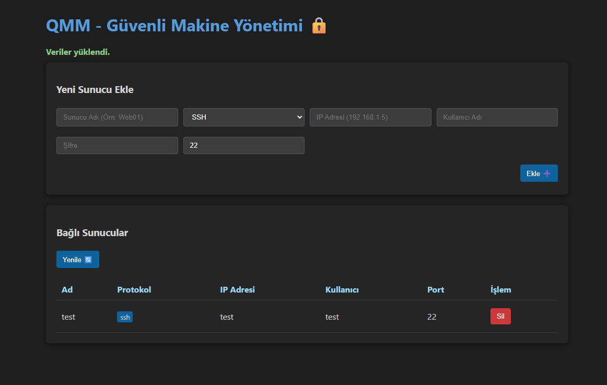

# QMM - Güvenli Makine Yönetim Sistemi

Development objective: To set up a server capable of hosting data from a large number of virtual machines<br>
It is intended to be developed in integration with [Karshard](https://github.com/DeveloperKubilay/Karshard)/[Termix](https://github.com/DeveloperKubilay/termix)/[Runship](https://github.com/DeveloperKubilay/runship)

All are open source:<br>
Karshard: Launches virtual servers when the system is under load (e.g., launching and deleting temporary machines to protect against DDoS attacks)<br>
Termix: Provides an interface through which you can access your virtual servers<br>
Runship: Allows you to deploy to all your machines just like Docker, thanks to its code deployment system

---

Geliştirilme amacı: Çok fazla sanal makinenin bilgisini barındırabileceğiniz bir sunucu kurmak<br>
[Karshard](https://github.com/DeveloperKubilay/Karshard)/[Termix](https://github.com/DeveloperKubilay/termix)/[Runship](https://github.com/DeveloperKubilay/runship)'e entegre olarak geliştirilmesi amaçlanıyor

Hepsi açık kaynaklıdır:<br>
Karshard: Sisteme yük binince sanal sunucular açıyor (örn: ddos saldırıları koruma için kısa süreli makine açıp silme)<br>
Termix: Sanal sunucularınıza erişebileceğiniz bir arayüz sunuyor <br>
Runship: Kod dağıtma sistemi tüm makinelerinize tıpkı docker gibi dağıtın




Node.js tabanlı, yüksek güvenlikli (HTTPS + Şifreli Veritabanı) Sunucu Yönetim Sistemi.

## Özellikler

- **HTTPS (SSL/TLS)**: Tüm iletişim şifreli kanal üzerinden yapılır.
- **Veri Şifreleme (AES-256-GCM)**: Veritabanında saklanan parolalar AES-256 ile şifrelenir.
- **API Key Doğrulaması**: İzinsiz erişimleri engellemek için API Anahtarı kullanılır.
- **İki Arayüz**:
    1. **Web Admin Paneli**: Modern ve şık bir arayüz.
    2. **CLI İstemci (Client)**: Terminal üzerinden hızlı yönetim.

## Kurulum ve Çalıştırma

### 1. Sunucuyu Başlat (Server)

```bash
cd server
npm start
```
- Sunucu **https://localhost:3443** adresinde çalışır.
- İlk açılışta tarayıcınız "Güvenli Değil" uyarısı verebilir (Self-signed sertifika nedeniyle). Gelişmiş -> Siteye İlerle diyerek geçebilirsiniz.
- Admin Panel için tarayıcıdan **https://localhost:3443** adresine gidin.
- **Varsayılan API Key**: `super-secret-admin-key-change-me`

### 2. İstemciyi Başlat (Client CLI)

```bash
cd client
node client.js
```
- Menüden host ekleyebilir, silebilir veya listeleyebilirsiniz.
- İletişim HTTPS üzerinden güvenli sağlanır.

## Güvenlik Notları

- **API Anahtarı**: `server.js` ve `client.js` dosyalarındaki `API_KEY` değişkenini prodüksiyon ortamında mutlaka değiştirin.
- **Sertifika**: Geliştirme ortamı için otomatik "Self-signed" sertifika üretilir. Prodüksiyon için gerçek bir SSL sertifikası (Let's Encrypt vb.) kullanılmalıdır.
"# QMM" 
